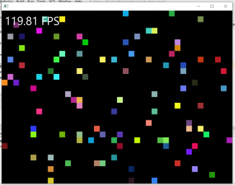

# Zadanie dodatkowe - wątki i animacja w JavaFx

*Jest to zadanie dodatkowe za 10 punktów*

## Opis

Celem jest realizacja przykładu z kulkami za pomocą biblioteki JavaFX.

1. Aplikacja ma składać się z dwóch komponentów
   - Modelu zawierającego kulki
   - Widoku - obiektu `javafx.scene.layout.Pane` wraz z elementami potomnymi
2. Model jest animowany przez wątek. Okresowo, np. co 10ms przesuwa kulki. Zapewniamy wzajemne wykluczanie za pomocą semafora lub umieszczając wszelkie operacje na kulkach w bloku synchronicznym `synchronized(balls) {...}`
3. Widok jest animowany przez wbudowany watek JavaFX. Realizowane jest to za pomocą obiektu klasy `AnimationTimer`. W metodzie, którą nazwiemy `updateView()`:
   - usunięte zostaną wszystkie węzły potomne widoku (czyli kulki z poprzedniej iteracji)
   - zachowując wzajemne wykluczanie odczytane zostaną położenia i kolory kulek
   - na ich podstawie zostaną utworzone węzły JavaFx w odpowiednim miejscu

## Uwagi techniczne

- JavaFX nie jest częścią standardowej biblioteki. Musisz wygenerować projekt typu JavaFX korzystający z Mavena lub Gradle. Polecam Mavena.
- JavaFX może definiować układ komponentów w XML. Nie korzystamy z tego. Po wygenerowaniu wyrzuć plik `*.fxml` z zasobów oraz usuń `HelloControler`
- Możesz zbudować układ GUI bezpośrednio w kodzie - wraz z menu, komponentem Toolbar, polem tekstowym pełniącym rolę komponentu statusbar, itp.
- Drzewo węzłów JavaFX maożna uaktualniać wyłącznie w wątku JavaFX. W przeciwnym przypadku generowane będą wyjątki.
- Aby uaktualnić pewne własności komponentów - wyłączane przyciski, uaktualnienie rozmiarów - musisz połączyć ze sobą własności `property`, np.
    ```java
    child.widthProperty().bind(parent.widthProperty());
 
    // gdzieś w kodzie
    SimpleBooleanProperty isRunning = new SimpleBooleanProperty(false);
    
    // gdzieś indziej
    button3.disableProperty().bind(somewhereInTheCode.isRunning);
    ```

## Przykład



## Klasa pomocnicza do obliczania FPS

```java
import java.util.ArrayDeque;
 
public class MovingAverage {
    int windowSize;
    ArrayDeque<Long> values;
 
    public MovingAverage(int windowSize) {
        this.windowSize = windowSize;
        values =new ArrayDeque<>(windowSize);
    }
    public void add(long value) {
        while(values.size() >= windowSize) values.poll();
        values.offer(value);
    }
    public double getMean() {
        if (values.isEmpty()) return 0;
        double mean = values.stream().mapToDouble(a->a).average().getAsDouble();
        return mean;
    }
}
```

## Aplikacja z widokiem i wątkiem uaktualniającym widok

```java
import java.util.Locale;
import java.util.Random;
 
import javafx.animation.AnimationTimer;
import javafx.application.Application;
import javafx.scene.Group;
import javafx.scene.Scene;
import javafx.scene.layout.Pane;
import javafx.scene.paint.Color;
import javafx.scene.shape.Rectangle;
import javafx.scene.text.Font;
import javafx.scene.text.Text;
import javafx.stage.Stage;
 
public class RandomRectangles extends Application {
    private final Random random = new Random();
    static final int N = 100;
    static final int SIZE = 20;
 
    Group group = new Group();
    Pane root = new Pane();
    MovingAverage mave = new MovingAverage(300);
 
 
    void updateView() {
        // usuń wszystkie węzły potomne grupy
        group.getChildren().clear();
        int w = (int) (root.getWidth() / SIZE);
        int h = (int) (root.getHeight()/SIZE);
        // wygeneruj nowe węzły na podstawie modelu
        for (int i = 0; i < N; i++) {
            int x = random.nextInt(w) * SIZE;
            int y = random.nextInt(h) * SIZE;
            Rectangle r = new Rectangle(x, y, SIZE, SIZE);
            var color = Color.color(random.nextDouble(), random.nextDouble(), random.nextDouble());
            r.setFill(color);
            group.getChildren().add(r);
        }
    }

    @Override
    public void start(final Stage primaryStage) {
        root.getChildren().add(group);
        final Scene scene = new Scene(root, 800, 600, Color.BLACK);
        root.setOpacity(1);
        updateView();
        primaryStage.setScene(scene);
        primaryStage.show();
 
        new AnimationTimer() {
            long lastPaint = -1;
            double fps = 0;
            int counter = 0;
            MovingAverage mave = new MovingAverage(300);
 
            void updateFps() {
                double diff = mave.getMean();
                diff /= 1e9;
                if (diff > 0) {
                    fps = 1 / diff;
                }
            }

            void addFPS() {
                Text text = new Text();
                text.setFont(new Font(40));
                text.setFill(Color.WHITE);
                text.setText(String.format(Locale.US, "%.2f FPS", fps));
                text.setX(10);
                text.setY(50);
                group.getChildren().add(text);
            }

            @Override
            public void handle(long now) {
                if (lastPaint > 0) {
                    mave.add(now - lastPaint)
                };
                lastPaint = now;
                counter++;
                updateView();
                if (counter % 50 == 0) updateFps();
                addFPS();
            }
        }.start();
    }
 
    public static void main(String[] args) {
        launch(args);
    }
}
```
